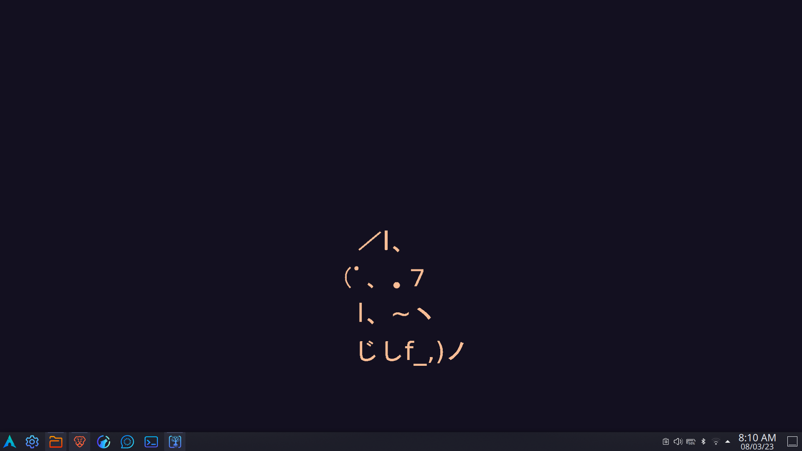
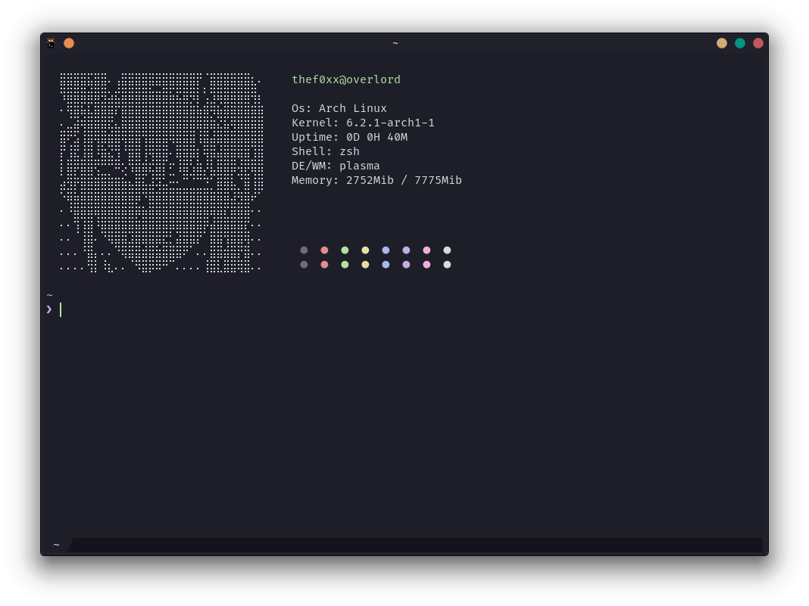
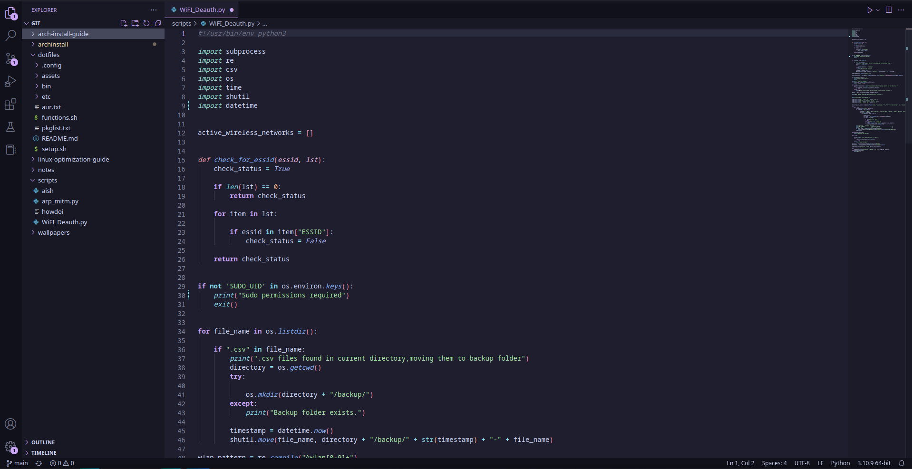
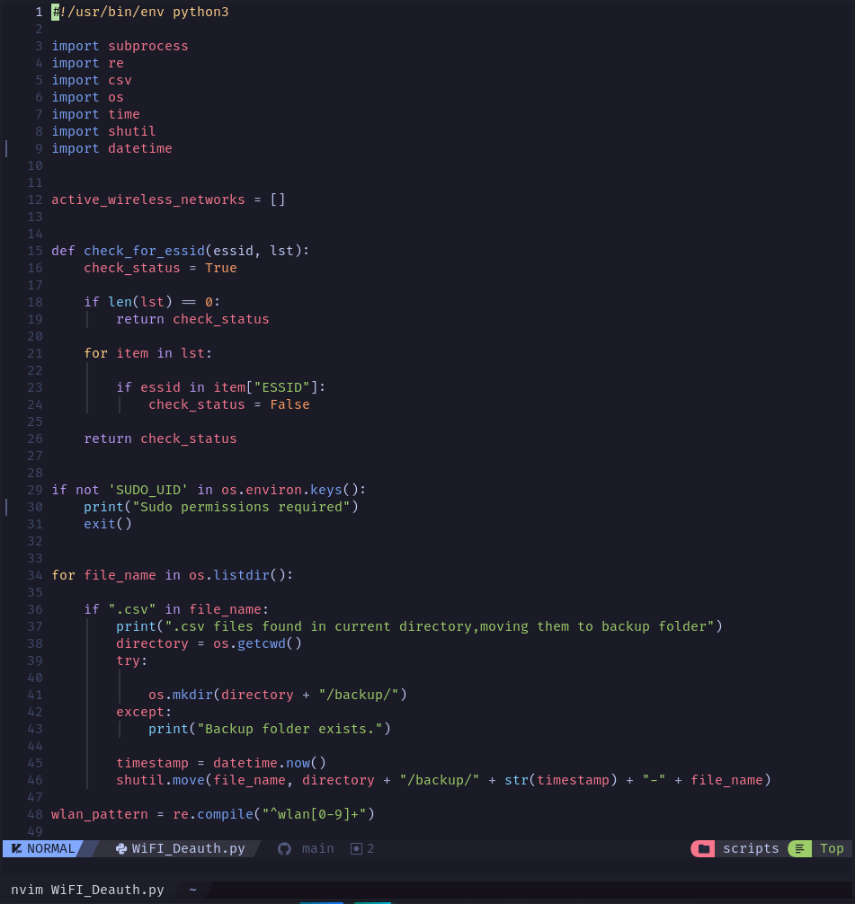
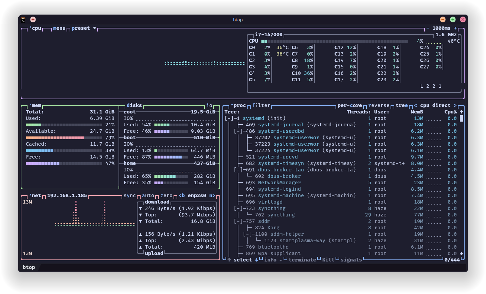

  

**OS** : [Arch Linux](archlinux.org)

**Shell** : [zsh](https://zsh.sourceforge.io/)

**DE** : [Plasma](https://kde.org/plasma-desktop/)

**WM** : [KWin](https://userbase.kde.org/KWin)

**WM Theme** : [Catppuccin Mocha Lavender](https://github.com/catppuccin/kde)

**Theme** : [Catppuccin Mocha Modern](https://github.com/catppuccin/kde)

**Icons** : Breeze Dark & [Beautyline](https://store.kde.org/p/1425426/)

**Terminal** : [kitty](https://github.com/kovidgoyal/kitty)

**Editor** : [Neovim](https://github.com/neovim/neovim)

**Fetch** : [fetch](https://github.com/Manas140/fetch)

**Install packages from list:**
`doas pacman -S --needed $(comm -12 <(pacman -Slq | sort) <(sort pkglist.txt))`

**Install foreign packages(AUR):**
`paru -S --needed - < aur.txt`

**To make sure the installed packages of your system match the list and remove all the packages that are not mentioned in it:**
`doas pacman -Rsu $(comm -23 <(pacman -Qq | sort) <(sort pkglist.txt))`

**Wallpapers** :  [hazedolores/wallpapers](https://gitlab.com/hazedolores/wallpapers)
