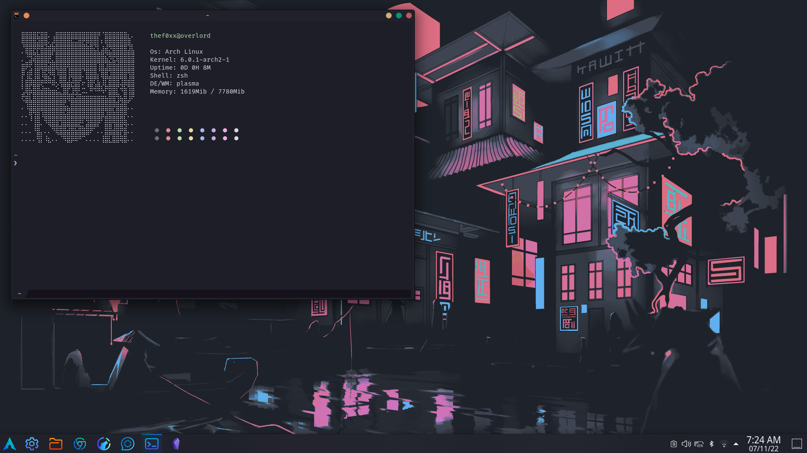

**OS** : Arch Linux , OpenSUSE

**Shell** : zsh

**DE** : Plasma

**WM** : KWin

**WM Theme** : Fancy-Aurorae

**Theme** : Fancy-Dark

**Icons** : Beautyline

**Terminal** : kitty

**Fetch** : [fetch](https://github.com/Manas140/fetch)

**Install packages from list:**
`doas pacman -S --needed $(comm -12 <(pacman -Slq | sort) <(sort pkglist.txt))`

**Install foreign packages(AUR):**
`paru -S --needed - < aur.txt`

**To make sure the installed packages of your system match the list and remove all the packages that are not mentioned in it:**
`doas pacman -Rsu $(comm -23 <(pacman -Qq | sort) <(sort pkglist.txt))`

**Wallpapers** : [catppuccin/wallpapers](https://github.com/catppuccin/wallpapers)
                 [thef0xx/wallpapers](https://gitlab.com/thef0xx/wallpapers)
 
..
