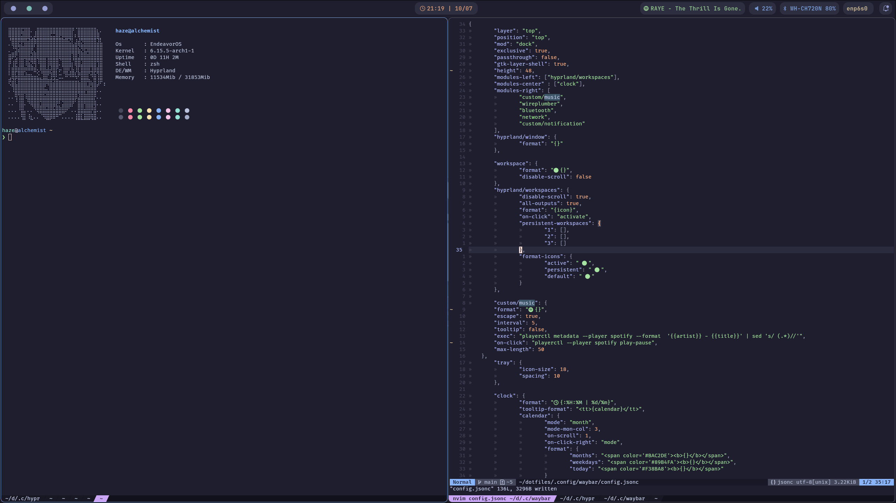
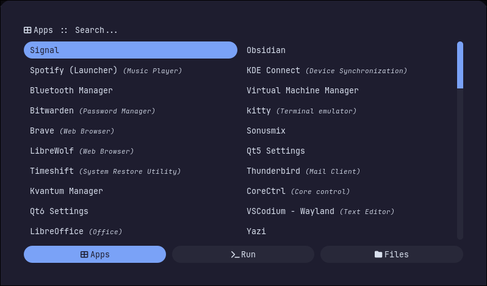

**OS** : [Arch Linux](https://archlinux.org)

**Shell** : [fish](https://fishshell.com/)

**WM** : [Hyprland](https://hypr.land/)

**Status Bar** : [Waybar](https://github.com/Alexays/Waybar)

**Colorscheme** : [Catppuccin Mocha](https://github.com/catppuccin/catppuccin)

**Terminal** : [kitty](https://github.com/kovidgoyal/kitty)

**Editor** : [Neovim](https://github.com/neovim/neovim)

**Install packages from pkglist.txt:**
`doas pacman -S --needed $(comm -12 <(pacman -Slq | sort) <(sort pkglist.txt))`

**Install AUR packages:**
`paru -S --needed - < aur.txt`

